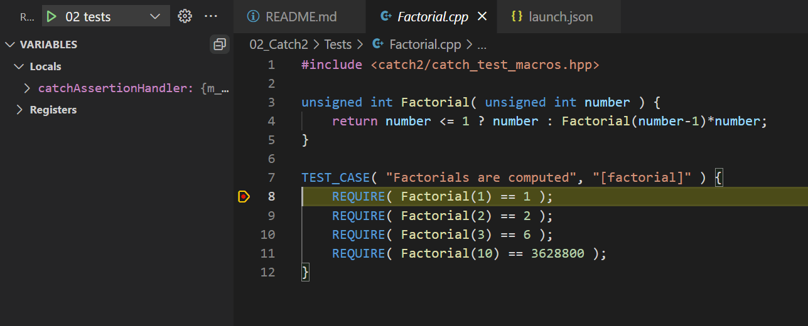

# CMake Starters

- VS Code, C++, CMake, Catch2, Juce
- By Anthony Leotta
- 1/15/2022

## Description

This project was created to serve as a reference on how to setup C++ project using CMake for builds, Catch2 for Unit Tests, VS Code as an IDE. Since most C++ projects will require an external library, I will provide example integrations of popular C++ lirabries such as Juce.

## Future

This is currently a Windows centric project.  My plan is to eventually get this project working on Windows, Mac, Linux and Raspberry PI.

## On Windows

1. I installed [Microsoft Visual Studio 2022 Community Edition](https://visualstudio.microsoft.com/vs/community/)
    - Supports 64 bit
    - Feature packed
    - Free

## Install CMake

1. Download and install [CMake](https://cmake.org/download/)
1. Test by running cmake on the command line
    ```
    cmake --version
    ```

## Install Microsoft Visual Studio Code

1. Download and Install [VS Code](https://code.visualstudio.com/)
1. Install VS Code Plugins
    1. [C/C++ Microsoft](https://marketplace.visualstudio.com/items?itemName=ms-vscode.cpptools)
    2. [CMake](https://marketplace.visualstudio.com/items?itemName=twxs.cmake)
    3. [CMake Tools](https://marketplace.visualstudio.com/items?itemName=ms-vscode.cmake-tools)

## CMake Configuration

- With CMake Tools installed, CMake is automated and will even configure when VS Code starts up.
- Cmake can be configured by launching a CMake Tools Extension command.
1. F1
1. CMake: Configure
1. On Windows using Microsoft Visual Studio 2022, choose Microsoft Visual Studio 2022 Release - amd64
1. Build by hitting the F7 key

## Project 1 Hello

1. This is a basic C++ project.
1. On Windows: build\01_Hello\Debug\hello.exe

## Project 2 Testing

1. This is a basic C++ project with unit tests
    - Downloads and configurs Catch2
    - Adds Catch2 include to path
1. Unit tests Catch2 header inclusion
    ```
    #include <catch2/catch_test_macros.hpp>
    ```
1. On Windows: build\01_Hello\Debug\hello2.exe
1. On Windows: build\01_Hello\Debug\tests.exe

## Add F5 Key launching and interactive step debugging

1. Create a .vscode\launch.json file
1. Add a section for 01_Hello
    ```
    {
        "name": "01 hello",
        "type": "cppvsdbg",
        "request": "launch",
        "program": "${workspaceFolder}/build/01_Hello/Debug/hello.exe",
        "args": [],
        "stopAtEntry": false,
        "cwd": "${fileDirname}",
        "environment": [],
        "console": "externalTerminal"
    }
    ```
1. Add a sections for 02_Testing hello2 and tests
    ```
    {
        "name": "02 hello",
        "type": "cppvsdbg",
        "request": "launch",
        "program": "${workspaceFolder}/build/02_Testing/Debug/hello2.exe",
        "args": [],
        "stopAtEntry": false,
        "cwd": "${fileDirname}",
        "environment": [],
        "console": "externalTerminal"
    },
    {
        "name": "02 tests",
        "type": "cppvsdbg",
        "request": "launch",
        "program": "${workspaceFolder}/build/02_Testing/Debug/tests.exe",
        "args": [],
        "stopAtEntry": false,
        "cwd": "${fileDirname}",
        "environment": [],
        "console": "externalTerminal"
    },
    ```
1. Breakpoints can be set on executables and tests.


