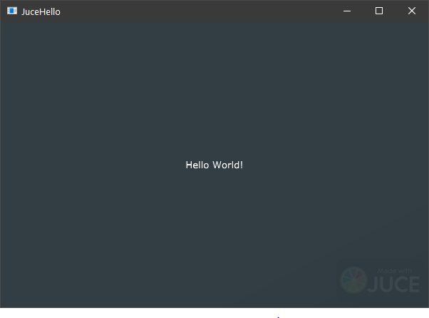

# CMake Starters

- VS Code, C++, CMake, Catch2, Juce
- By Anthony Leotta
- 1/15/2022

## Description

This project was created to serve as a reference on how to setup C++ project using CMake for builds, Catch2 for Unit Tests, VS Code as an IDE. Since most C++ projects will require an external library, I will provide example integrations of popular C++ lirabries such as Juce.

I'll list my motivations for creating and maintaining this repo:
- I want to use VS Code not Microsoft Visual Studio 2022 Community Edition as my IDE.
    - I use VS Code on Linux for my day job.
    - I like the search feature for VS Code.
    - I like how VS Code displays error statements.
    - I like how VS Code interactive step debugging works.
- I do want to build outside a IDE using the command line.
    - I like that CMake not only supports the command line, it firmnly embraces it.
    - There are many reasons to want to do your builds on the command line. I am using docker and kubernetes alot for my day job.  I do docker builds many (>20) times a day on some days.  My company also has Jenkins setup that does builds and runs unit tests as parf of Pull Request validation.  My eyes are open to the fact that most operations really can't rely on a IDE and must be done on the command line.

## Why? Shout out to the Audio Programmer!

I watched two Audio Programmer VLogs on CMake and Juce by Eyal Amir, Joshua Hodge, Rahcel Locke and Timur Doumler. Here are the links:

- [CMake and JUCE 6 - What is CMake and Why Should I Use It?](https://www.youtube.com/watch?v=FKVK7TyEJ5g)
- [Audio Programmer Virtual Meetup - Jan 11 @ 18:30 GMT](https://www.youtube.com/watch?v=koD66WQJtkU&t=2498s)


I looked at CMake and became convinced that the features it offers solve many problems facing C++ developers.   I was blown away by the fact that CMake downloads libraries from git or other locations on the net and then configures them based your platform and settings.

## Future

This is currently a Windows centric project.  My plan is to eventually get this project working on Windows, Mac, Linux and Raspberry PI.

- Add examples of using other C++ libraries
    - [Faust](https://faust.grame.fr/)
    - [Steinberg asiosdk](https://www.steinberg.net/asiosdk)
    - [Boost](https://www.boost.org/)
    - [Eigen](https://eigen.tuxfamily.org/index.php?title=Main_Page)
    - [Maximilian](https://github.com/micknoise/Maximilian)
    - [KFR](https://www.kfrlib.com/)
    - [eDSP](https://github.com/mohabouje/eDSP)
- Add examples of using 3rd Party Juce Modules
    - [Tracktion Engine](https://github.com/Tracktion/tracktion_engine)
    - [Organic UI](https://github.com/benkuper/juce_organicui)
    - [Organic UI/Timeline](https://github.com/benkuper/juce_timeline)
    - so many others...

## On Windows

1. I installed [Microsoft Visual Studio 2022 Community Edition](https://visualstudio.microsoft.com/vs/community/)
    - Supports 64 bit
    - Feature packed
    - Free

## Install CMake

1. Download and install [CMake](https://cmake.org/download/)
1. Test by running cmake on the command line
    ```
    cmake --version
    ```

## Install Microsoft Visual Studio Code

1. Download and Install [VS Code](https://code.visualstudio.com/)
1. Install VS Code Plugins
    1. [C/C++ Microsoft](https://marketplace.visualstudio.com/items?itemName=ms-vscode.cpptools)
    2. [CMake](https://marketplace.visualstudio.com/items?itemName=twxs.cmake)
    3. [CMake Tools](https://marketplace.visualstudio.com/items?itemName=ms-vscode.cmake-tools)

## CMake Configuration

- With CMake Tools installed, CMake is automated and will even configure when VS Code starts up.
- Cmake can be configured by launching a CMake Tools Extension command.
1. F1
1. CMake: Configure
1. On Windows using Microsoft Visual Studio 2022, choose Microsoft Visual Studio 2022 Release - amd64
1. Build by hitting the F7 key

## Project 1 Hello

1. This is a basic C++ project.
1. On Windows: build\01_Hello\Debug\hello.exe

## Project 2 Testing

1. This is a basic C++ project with unit tests
    - Downloads and configurs Catch2
    - Adds Catch2 include to path
1. Unit tests Catch2 header inclusion
    ```
    #include <catch2/catch_test_macros.hpp>
    ```
1. On Windows: build\01_Hello\Debug\hello2.exe
1. On Windows: build\01_Hello\Debug\tests.exe

## Add F5 Key launching and interactive step debugging

1. Create a .vscode\launch.json file
1. Add a section for 01_Hello
    ```
    {
        "name": "01 hello",
        "type": "cppvsdbg",
        "request": "launch",
        "program": "${workspaceFolder}/build/01_Hello/Debug/hello.exe",
        "args": [],
        "stopAtEntry": false,
        "cwd": "${fileDirname}",
        "environment": [],
        "console": "externalTerminal"
    }
    ```
1. Add a sections for 02_Testing hello2 and tests
    ```
    {
        "name": "02 hello",
        "type": "cppvsdbg",
        "request": "launch",
        "program": "${workspaceFolder}/build/02_Testing/Debug/hello2.exe",
        "args": [],
        "stopAtEntry": false,
        "cwd": "${fileDirname}",
        "environment": [],
        "console": "externalTerminal"
    },
    {
        "name": "02 tests",
        "type": "cppvsdbg",
        "request": "launch",
        "program": "${workspaceFolder}/build/02_Testing/Debug/tests.exe",
        "args": [],
        "stopAtEntry": false,
        "cwd": "${fileDirname}",
        "environment": [],
        "console": "externalTerminal"
    },
    ```
1. Breakpoints can be set on executables and tests. In the below screen capture, the debugger is launched for a Catch2 unit test example.


## Project 3 Juce UI Application

1. This is a basic Juce Hello example project.
    - Juce is downloaded and configured
    - Juce CMake extensions take over and do the heavy lifting
    - Juce Framework is now installed for other applications in this series to use.
1. On Windows: \build\03_JuceHello\JuceHello_artefacts\Debug\JuceHello.exe


